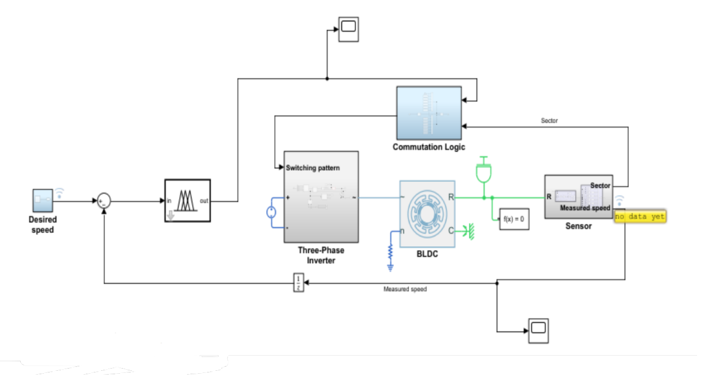

# Inverter-based Fuzzy Logic Control (FLC) of BLDC Motor Speed

## Description  
This project implements a Fuzzy Logic Controller (FLC) to regulate the speed of a Brushless DC (BLDC) motor using MATLAB/Simulink. The system integrates a three-phase inverter for electronic commutation, Hall-effect sensors for rotor position feedback, and a custom FLC to dynamically adjust the PWM duty cycle for precise speed control. The design targets applications in robotics, electric vehicles, and industrial automation, demonstrating high efficiency and robustness across varying load conditions.

## Key Aspects  
- **Control Strategy**: Fuzzy Logic Controller (FLC) replaces traditional PID, leveraging linguistic variables and rule-based decision-making for adaptive speed regulation.  
- **Hardware Modeling**: Simulink-based BLDC motor model with four pole-pairs, six-sector commutation, and three-phase inverter.  
- **Sensor Integration**: Hall-effect sensors for real-time rotor position tracking and sector-based phase activation.  
- **Performance Validation**: Simulations confirm accurate speed tracking at 400 RPM (low), 1200 RPM (high), and dynamic ranges (400–1200 RPM).  
- **Applications**: Suitable for electric vehicles, drones, and industrial systems requiring efficient motor control.  

## Components  
- **BLDC Motor**: 3-phase, 4 pole-pair model with trapezoidal commutation.  
- **Inverter**: Three-phase PWM inverter for precise voltage/frequency control.  
- **Sensors**: Hall-effect sensors for position feedback; motion sensor for speed measurement.  
- **FLC Design**:  
  - **Input**: Error (desired vs. actual speed) with 7 fuzzy sets (e.g., "Large Negative" to "Large Positive").  
  - **Output**: Duty cycle with 7 fuzzy sets (e.g., "Very Low" to "Very High").  
  - **Rule Base**: 49 rules mapping error to duty cycle adjustments.  

## Methodology  
1. **Commutation Logic**: Six-sector switching pattern activates phases based on rotor position (60° resolution).  
2. **Inverter Control**: PWM signals generated by FLC drive the three-phase inverter.  
3. **FLC Workflow**:  
   - **Fuzzification**: Convert speed error to linguistic variables.  
   - **Inference**: Apply rule base to determine duty cycle adjustment.  
   - **Defuzzification**: Output crisp duty cycle value to inverter.  

## Results  
- **Speed Tracking**: <2% steady-state error across tested ranges (400–1200 RPM).  
- **Torque Profile**: Stable torque output under varying loads.  
- **Phase Current/Voltage**: Optimal waveforms validate efficient commutation.  

## References  
1. Krishnan, R. (2001). *Electric Motor Drives: Modeling, Analysis, and Control*. Prentice Hall.  
2. Kim & Sul (2013). *Smooth Commutation of BLDC Motors via Predictive Control*. IEEE TPEL.  
3. Monolithic Power Systems. *BLDC Motor Fundamentals*. [Online].  

*Developed by Marwan Sallam, Amr Hassan, Ahmed Ibrahim, and Zeyad Eid at the German University in Cairo (GUC).* 
